# v2raya-ubuntu-guide
在 Ubuntu 系统上部署 V2RayA 的详细教程

## Ubuntu18.0在线安装VMwareTools：
1、卸载旧版本VMwareTools
`sudo apt-get autoremove open-vm-tools`
2、联网安装VMware tools
`sudo apt-get install open-vm-tools-desktop`
3、重启虚拟机即可

## 安装v2raya
v2rayA官方文档地址：https://v2raya.org/docs/prologue/introduction/
### 方法一通过软件源安装(推荐)
#### 添加公钥：
`wget -qO - https://apt.v2raya.org/key/public-key.asc | sudo tee /etc/apt/keyrings/v2raya.asc` 
#### 添加 V2RayA 软件源
`echo "deb [signed-by=/etc/apt/keyrings/v2raya.asc] https://apt.v2raya.org/ v2raya main" | sudo tee /etc/apt/sources.list.d/v2raya.list`

`sudo apt update`
#### 安装 V2RayA
`sudo apt install v2raya v2ray`
#### 启动 v2rayA / 设置 v2rayA 自动启动
`sudo systemctl start v2raya.service`

`sudo systemctl enable v2raya.service`
### 方法二 手动导入公钥及安装（若方法一失败）
#### 浏览器下载密钥
ubuntu内置浏览器访问 https://apt.v2raya.org/key/public-key.asc 默认保存到 /主目录/Download (如果是中文语言那就是 /主目录/下载 或 /home/你的用户名/下载 或 其他位置/计算机/home/你的用户名/下载)
#### 手动复制到密钥目录
  `sudo cp ~/Downloads/v2raya-key.asc /etc/apt/keyrings/v2raya.asc` 
  
注意文件路径别写错了 ~表示代表当前用户的家目录（/home/你的用户名） /Downloads/也可能是/下载/如果你是中文系统 再就是文件名可能不是v2raya-key.asc你可以用文件管理器查看文件是否是这个名字，我的是public-key.asc
#### 添加v2RayA软件源、安装、启动、自启动
这部分与上面方法一一样这里不再赘述
### 注意⚠️ 
若显示 “tee: /etc/apt/keyrings/v2raya.asc: 没有那个文件或目录” 这是因为在较新的 Ubuntu 版本才默认使用这个目录存储密钥，而旧版本没有，这时候需手动创建该目录。
#### 创建密钥存储目录：
`sudo mkdir -p /etc/apt/keyrings`
#### 重新导入 GPG 密钥：
`wget -qO - https://apt.v2raya.org/key/public-key.asc | sudo tee /etc/apt/keyrings/v2raya.asc`

若导入密钥时没有明显反应（如无输出或无错误提示）通常是因为 密钥文件未成功获取 或 命令执行过程中静默失败，只时候可以尝试手动下载并导入
## 启动v2raya
### 开始并创建账号
在浏览器输入服务器ip加端口号(2017) 默认是127.0.0.1:2017，然后设置你的登录账号和密码，如下图

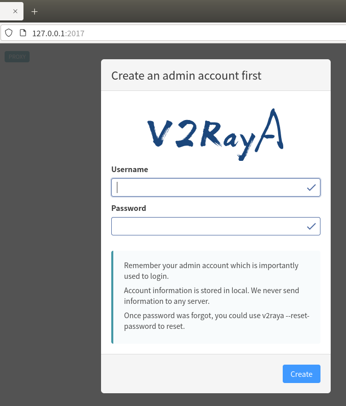

若密码遗忘可以使用`sudo v2raya --reset-password`命令重置。
### 导入订阅
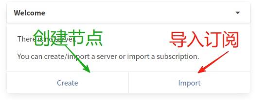

根据节点链接、订阅链接、扫描二维码和批量导入等方式导入

输入订阅链接并点击Confirm

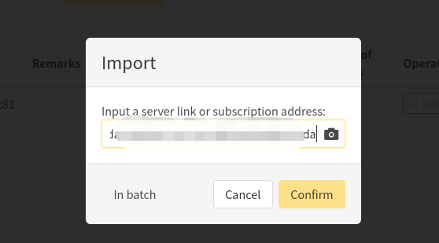

成功导入订阅点击Update刷新

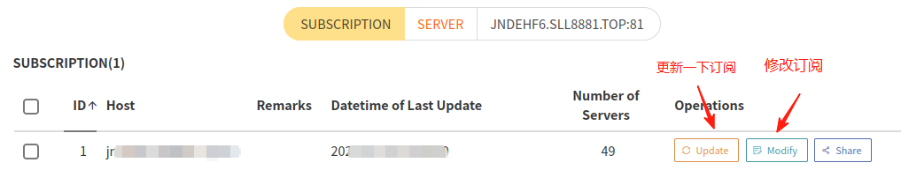
### 链接节点并启动服务
切换至该订阅节点列表

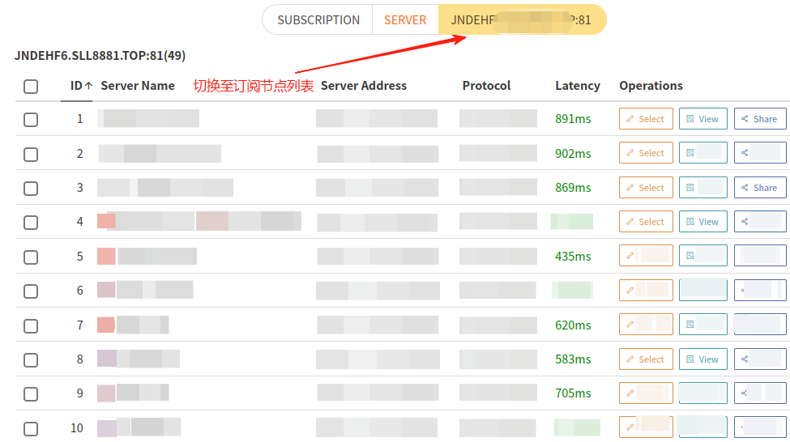

选择你想要连接的节点点击Select然后点击Ready

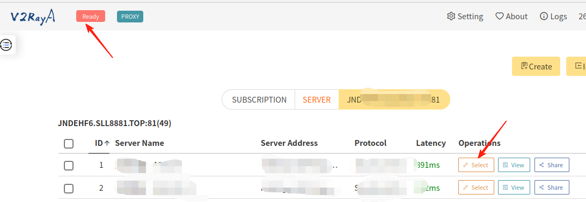

在启动服务后，所连接的节点呈现蓝色，左上角的图标也显示为蓝色的正在运行或Running，代表服务启动成功。
### 创建节点
若不想导入订阅只想创建单独节点可以照如下步骤进行

点击面板右上黄色的Create创建，选择链接类型，例如我这里是Trojan

先根据你购买的vpn节点，点击节点详细信息找到如下信息，并将信息填写到v2ray中，然后点击Save and Apply 保存和应用

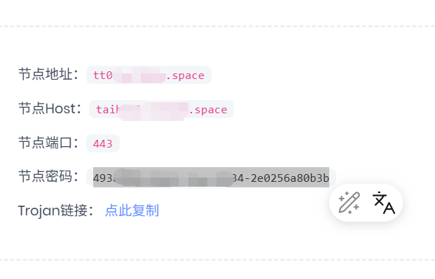
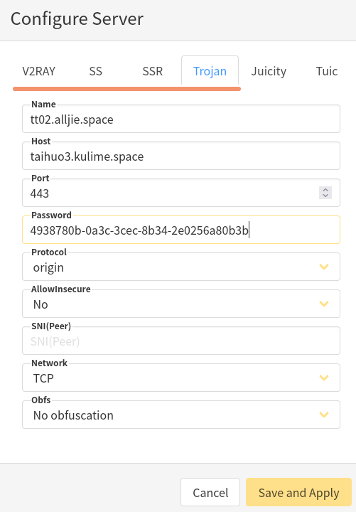
## 配置代理
点击Setting设置，将图中与你的设置不一样的进行修改，其他的不用修改

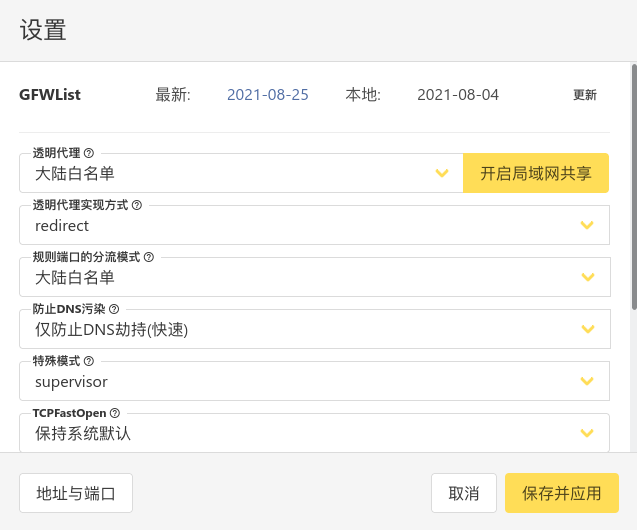
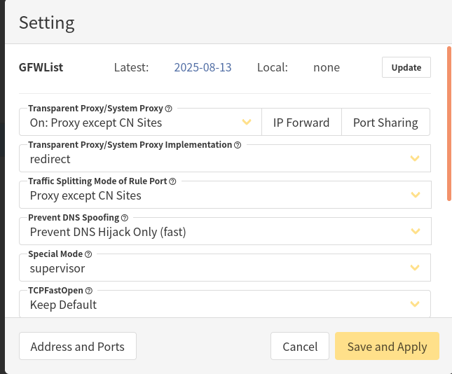

这种方法是 v2rayA 推荐的方法。它相比于其他方法具有诸多优势，v2rayA 可以一键开启透明代理，为几乎所有程序提供代理服务。
## 测试并成功
打开访问的网站 显示页面成功 若显示缓慢 需切换其他节点

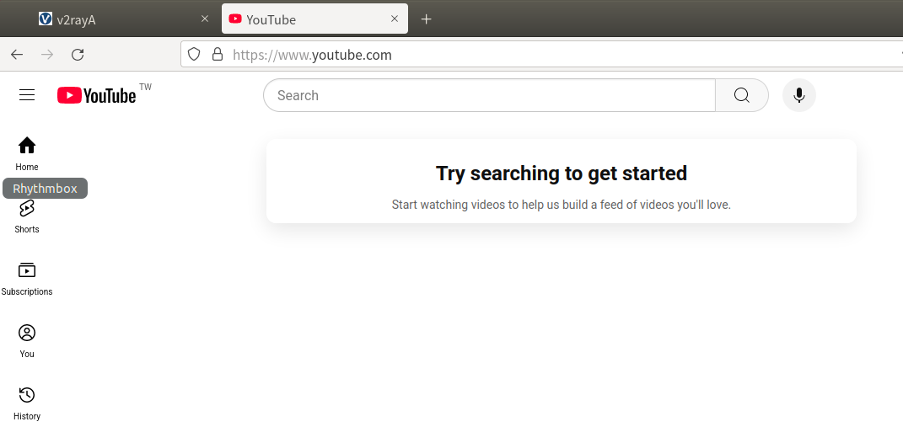

